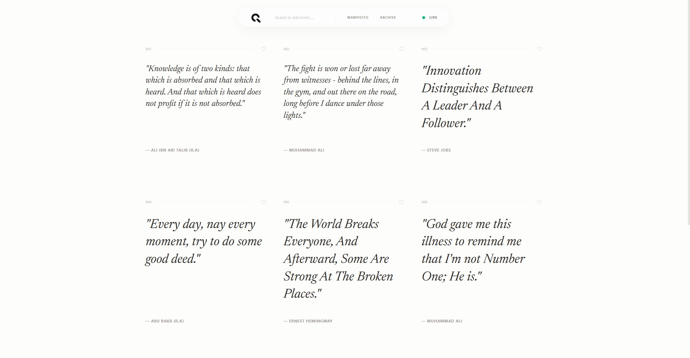

<div align="center">


<br />
<br />


</div>

<br/>

## Qutera

Qutera is a high-end, minimalist quote archive built with Vue 3 and TypeScript. Conceived as "The Art of Curated Wisdom," it provides a sophisticated, distraction-free interface for exploring an infinite mosaic of human thought. The application follows a professional component-based architecture and utilizes modern patterns like Composables and Services to ensure clean, scalable code.

## Preview

<p align="center">
  
</p>

## Features

- **Infinite Scrolling Archive:** A seamless, endless vertical flow of wisdom powered by IntersectionObserver and GSAP animations.
- **Personal Collection:** A persistent "Save" system that allows users to curate their own archive, stored locally for private reflection.
- **Floating Glass Header:** A Dribbble-inspired, glassmorphic navigation island that centers the experience while maximizing screen estate.
- **Editorial Typography:** A premium pairing of *Inter* and *Newsreader* fonts, optimized for a sophisticated reading experience.
- **Global Search & Filter:** Instant discovery across the entire archive via a high-performance, real-time search interface.
- **Immersive Overlays:** Dedicated full-screen experiences for the Personal Archive and the Brand Manifesto, featuring fluid transitions.
- **Advanced SEO:** Best-practice implementation including dynamic OpenGraph tags and a custom SVG favicon for brand consistency.

## Tech Stack

- **Vue 3 (Composition API):** A modern, high-performance framework for building reactive user interfaces.
- **TypeScript:** Ensuring enterprise-grade type safety and robust developer experience.
- **Tailwind CSS v4:** High-fidelity styling using the latest utility-first framework standards for modern design.
- **GSAP (GreenSock):** Professional-grade animations for fluid transitions and interactive micro-moments.
- **Vite:** Next-generation frontend tooling for an ultra-fast development cycle and optimized production builds.
- **Newsreader Typography:** A high-contrast variable serif chosen for its prestigious editorial aesthetic.

## Getting Started

To get a local copy of this project up and running, follow these steps.

### Prerequisites

- **Node.js 20.x** or higher.
- **NPM** or **PNPM** for dependency management.

## Installation

1. **Clone the repository:**

   ```bash
   git clone https://github.com/fahmirizalbudi/qutera.git
   cd qutera
   ```

2. **Install dependencies:**

   ```bash
   npm install
   ```

3. **Development:**

   ```bash
   npm run dev
   ```

Access the application at [http://localhost:5173](http://localhost:5173).

## Deployment

The project is pre-configured for GitHub Pages. To deploy your own version:

```bash
npm run deploy
```

## License

All rights reserved. This project is for educational purposes and portfolio demonstration only.
